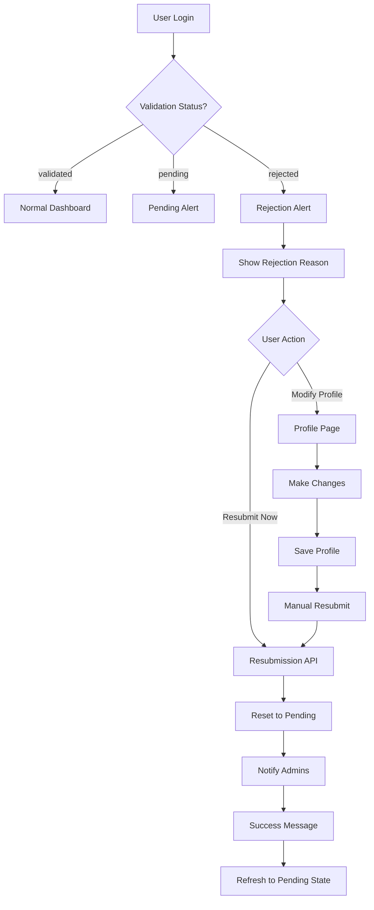

# F1.7 - Profile Resubmission Feature

## Overview

The Profile Resubmission feature allows rejected jury users to correct their profile issues and resubmit for validation without creating a new account. This feature provides a clear user experience for handling profile rejections and enables users to address validation concerns efficiently.

## Problem Statement

Previously, when a jury user's profile was rejected by an administrator:
1. Users only saw a generic "Compte rejeté" message without details
2. The jury centers page showed incorrect "pending validation" status for rejected users
3. No clear path existed for users to resubmit their profile for validation
4. Users had to contact support or create new accounts to retry validation

## Solution Architecture

### User Experience Flow



## Technical Implementation

### 1. Database Schema Updates

**Users Table Fields Used:**
- `validation_status`: VARCHAR(20) - 'pending', 'validated', 'rejected'
- `validation_comment`: TEXT - Admin's rejection reason
- `updated_at`: TIMESTAMP - Last modification timestamp

### 2. API Endpoints

#### Enhanced User API (`/api/user`)
**Changes Made:**
- Updated `getUser()` in `/lib/db/queries.ts` to include validation fields
- Now returns `validationStatus` and `validationComment` in user data

```typescript
// Before: Only basic user fields
const user = await db.select().from(users)...

// After: Includes validation fields
const user = await db.select({
  id: users.id,
  name: users.name,
  email: users.email,
  userType: users.userType,
  validationStatus: users.validationStatus,
  validationComment: users.validationComment,
  // ... other fields
}).from(users)...
```

#### New Resubmission API (`/api/profile/jury/resubmit`)
**Endpoint:** `POST /api/profile/jury/resubmit`

**Security:**
- Requires valid JWT session
- Only allows resubmission for users with `validation_status = 'rejected'`
- Returns 400 error for non-rejected users

**Process:**
1. Validates user authentication
2. Checks current validation status
3. Resets `validation_status` to 'pending'
4. Clears `validation_comment`
5. Updates `updated_at` timestamp
6. Triggers admin notification emails
7. Returns success response

**Response Format:**
```json
{
  "success": true,
  "message": "Profil soumis à nouveau pour validation avec succès"
}
```

### 3. Frontend Components

#### Rejection Alert Component (`/components/dashboard/rejection-alert.tsx`)

**Features:**
- Displays rejection reason from database
- Two action buttons:
  - "Modifier mon profil" - Navigate to profile page
  - "Soumettre à nouveau" - Immediate resubmission
- Loading states and error handling
- Success state with auto-refresh
- Responsive design with proper styling

**State Management:**
```typescript
const [isResubmitting, setIsResubmitting] = useState(false);
const [resubmitted, setResubmitted] = useState(false);
const [error, setError] = useState<string | null>(null);
```

#### Dashboard Integration (`/components/dashboard/jury-dashboard.tsx`)

**Implementation:**
- Fetches user data via SWR
- Conditionally renders rejection alert for rejected users
- Alert appears prominently at top of dashboard

```typescript
{user?.validationStatus === 'rejected' && (
  <RejectionAlert rejectionReason={user?.validationComment} />
)}
```

#### Jury Centers Page (`/app/(dashboard)/dashboard/jury/centres/page.tsx`)

**Enhanced Status Detection:**
```typescript
const isValidated = userValidationStatus === 'validated';
const isRejected = userValidationStatus === 'rejected';
const isPending = userValidationStatus === 'pending';
```

**Rejection Layout:**
- Dedicated section for rejected users
- Highlighted rejection reason in bordered box
- Dual action buttons (modify/resubmit)
- Prevents access to centers directory

## User Interface Design

### Rejection Alert Styling
- **Color Scheme:** Red theme (border-red-200, bg-red-50, text-red-800)
- **Icon:** XCircle from Lucide React
- **Layout:** Responsive with proper spacing
- **Actions:** Primary and secondary button styling

### Success State
- **Color Scheme:** Green theme (border-green-200, bg-green-50, text-green-800)
- **Icon:** CheckCircle from Lucide React
- **Auto-refresh:** 2-second delay before page reload

## Security Considerations

### Authentication & Authorization
- JWT session validation on all endpoints
- User ID extraction from verified session token
- No direct user ID manipulation in requests

### Data Validation
- Status validation before allowing resubmission
- Proper error messages for invalid states
- Database transaction safety

### Audit Trail
- Automatic timestamp updates on status changes
- Preservation of original creation dates
- Admin notification system maintains oversight

## Error Handling

### API Error Responses
```typescript
// Invalid user state
{ error: "La re-soumission n'est autorisée que pour les profils rejetés" }

// Authentication failure
{ error: "Non autorisé" }

// User not found
{ error: "Utilisateur non trouvé" }

// General server error
{ error: "Erreur lors de la re-soumission du profil" }
```

### Frontend Error Display
- Error messages shown in red alert boxes
- Non-blocking errors (email notifications)
- Graceful degradation for network issues

## Integration Points

### Email Notification System
- Reuses existing `notifyValidatorsOfNewJury()` function
- Sends notifications to all validator users
- Non-blocking - profile resubmission succeeds even if emails fail

### Profile Management
- Integrates with existing profile editing workflow
- Maintains compatibility with current validation process
- Preserves all profile data during resubmission

## Testing Scenarios

### Happy Path
1. User with rejected status sees rejection alert
2. User clicks "Soumettre à nouveau"
3. Status changes to pending
4. Admin receives notification
5. User sees success message

### Edge Cases
- Non-rejected user attempts resubmission → 400 error
- Unauthenticated user → 401 error
- Network failure during resubmission → Error display
- Email notification failure → Profile still resubmitted

### User Experience Testing
- Dashboard rejection alert visibility
- Jury centers page rejection layout
- Button states and loading indicators
- Success state and auto-refresh

## Performance Considerations

### Database Operations
- Single UPDATE query for status reset
- Indexed lookups on user ID
- Minimal data transfer

### Frontend Optimization
- SWR caching for user data
- Conditional rendering to avoid unnecessary API calls
- Optimistic UI updates where appropriate

## Deployment Notes

### Database Migration
No schema changes required - uses existing fields:
- `users.validation_status`
- `users.validation_comment`
- `users.updated_at`

### Environment Requirements
- Existing email service configuration
- JWT secret for session validation
- Database connection with proper permissions

## Monitoring & Analytics

### Key Metrics
- Resubmission success rate
- Time between rejection and resubmission
- Admin response time to resubmitted profiles
- User abandonment after rejection

### Logging
- Resubmission attempts (success/failure)
- Email notification status
- User authentication events
- Database operation timing

## Future Enhancements

### Potential Improvements
1. **Resubmission History**: Track multiple resubmission attempts
2. **Guided Corrections**: Highlight specific fields that need attention
3. **Partial Validation**: Allow admins to approve specific sections
4. **Automated Checks**: Pre-validate common issues before admin review
5. **Communication Channel**: Direct messaging between user and validator

### Scalability Considerations
- Batch processing for multiple resubmissions
- Queue system for high-volume validation periods
- Caching strategies for validation status checks

## Conclusion

The Profile Resubmission feature provides a complete solution for handling rejected jury profiles, improving user experience while maintaining administrative oversight. The implementation follows existing patterns in the SimplyJury codebase and integrates seamlessly with current validation workflows.

**Key Benefits:**
- Clear communication of rejection reasons
- Streamlined resubmission process
- Maintained data integrity and security
- Improved user retention and satisfaction
- Reduced support burden for profile issues
